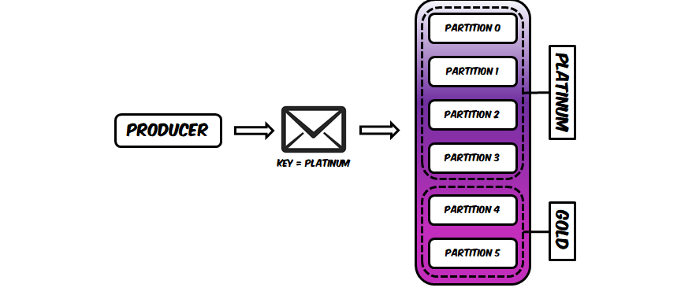
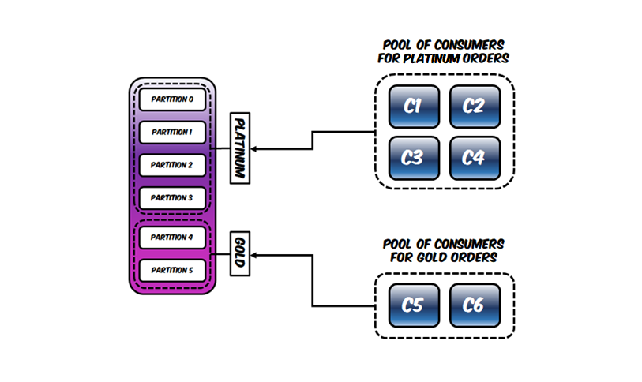

# Bucket Priority

Implement record prioritization in [Apache Kafka](https://kafka.apache.org) is often a hard task because Kafka doesn't support broker-level reordering of records like some messaging technologies do.
Though some developers see this as a limitation the reality is that it isn't because Kafka is not supposed to allow record reordering in the first place.
Kafka is a distributed [commit log](https://engineering.linkedin.com/distributed-systems/log-what-every-software-engineer-should-know-about-real-time-datas-unifying) and therefore records are immutable and so their ordering within partitions.
Nevertheless, this doesn't change the fact the developers may need to implement record prioritization in Kafka.

This project aims to address this problem while still proving a way to keep the implementation code simple.
In Kafka the smallest unit of read, write, and replication are partitions.
Partitions play a key role in how Kafka implements elasticity because they represent the parts of a topic that are spread over the cluster, as well as how Kafka implements fault-tolerance because each part can have replicas and these replicas are also spread over the cluster.
However, when developers write code to handle partitions directly they end up writing a rather more complex code, and often need to give up of some facilities that the Kafka architecture provides such as automatic rebalancing of consumers when new partitions are added and/or when a group leader fails.
This becames even more important when developers are interacting with Kafka via frameworks like [Kafka Connect](https://kafka.apache.org/documentation/#connect) and [Kafka Streams](https://kafka.apache.org/documentation/streams/) that by design don't expect that partitions are handled directly.

This projects addresses record prioritization by grouping partitions into simpler abstractions called buckets that express priority given their size.
Bigger buckets means higher priority and smaller buckets means less priority.
The project also addresses code simplicity by providing a way to do all of this with the pluggable architecture of Kafka.

Let's understand how this works with an example.



Here we can see that the partitions were grouped into the buckets `Platinum` and `Gold`.
The `Platinum` bucket has a higher priority and therefore was configured to have 70% of the allocation, whereas the `Gold` bucket has lower priority and therefore was configured to have only 30%.
This means that for a topic that contains 6 partitions 4 of them will be associated to the `Platinum` bucket and 2 will be associated to the `Gold` bucket.
To implement the record prioritization there has to be a process that ensures that records with higher priority will end up in one the partitions from the `Platinum` bucket and records with lower priority will end up in one the partitions from the `Gold` bucket.
Moreover, consumers need to subscribe to the topic knowing which buckets they need to be associated to.
This means that developers can decide to execute more consumers for the `Platinum` bucket and less consumers for the `Gold` bucket to ensure that high priority records are processed faster.

To ensure that each record will end up in their respective bucket you need to use the `BucketPriorityPartitioner`.
This partitioner uses data contained in the record key to decide which bucket to use and therefore which partition from the bucket the record should be written.
This partitioner distributes the records within the bucket using a round robin algorithm to maximize consumption parallelism.
On the consumer side you need to use the `BucketPriorityAssignor` to ensure that the consumer will be assigned only to the partitions that represent the bucket they want to process.



With the bucket priority you can implement record prioritization by having more consumers working on buckets with higher priorities while buckets with less priority can have less consumers.
Record prioritization can also be obtained by executing these consumers in a order that gives preference to processing high priority buckets before the less priority ones.
While coordinating this execution might involve some extra coding from your part (perhaps using some sort of scheduler) you don't necessarily have to write low-level code to manage partition assignment and keep your consumers simple by leveraring the standard `subscribe()` and `poll()` methods.

## Building the project

The first thing you need to do to start using this partitioner is building it. In order to do that, you need to install the following dependencies:

- [Java 11+](https://openjdk.java.net/)
- [Apache Maven](https://maven.apache.org/)

After installing these dependencies, execute the following command:

```bash
mvn clean package
```

## Using the partitioner

To use the `BucketPriorityPartitioner` in your producer you need to register it in the configuration.

```bash
Properties configs = new Properties();

configs.setProperty(ProducerConfig.PARTITIONER_CLASS_CONFIG,
   BucketPriorityPartitioner.class.getName());

KafkaProducer<K, V> producer = new KafkaProducer<>(configs);
```

To work properly you need to specify in the configuration which topic will have its partitions grouped into buckets.
This is important because in Kafka topics are specified in a record level and not in a producer level.
This means that the same producer can be used to write records into different topics, so the partitioner needs to know which topic will have their partitions grouped into buckets.


```bash
configs.setProperty(BucketPriorityConfig.TOPIC_CONFIG, "orders");
```

Finally you have to specify in the configuration which buckets will be configured and what is the partition allocation for each one of them.
The partition allocation is specified in terms of percentage.
Note that the usage of the symbol `%` is optional.


```bash
configs.setProperty(BucketPriorityConfig.BUCKETS_CONFIG, "Platinum, Gold");
configs.setProperty(BucketPriorityConfig.ALLOCATION_CONFIG, "70%, 30%");
```

The partitioner ensures that all partitions from the topic will be assigned to the buckets.
In case of the allocation result in some partitions being left behind because the distribution is not even, the remaining partitions will be assigned to the buckets using a round robin algorithm over the buckets sorted by allocation.

### Records and buckets

In order to specify which bucket should be used your producer need to provide this information on the record key.
The partitioner will inspect each key in the attempt to understand in which bucket the record should be written.
For this reason the key must be an instance of a [java.lang.String](https://docs.oracle.com/en/java/javase/11/docs/api/java.base/java/lang/String.html) and it need to contain the bucket name either as one literal string or as the first part of a string separated by an delimiter.
For example, to specify that the bucket is `Platinum` then following examples are valid:

* Key = `"Platinum"`
* Key = `"Platinum-001"`
* Key = `"Platinum-Group01-001"`

The default delimiter is `-` but you can change to something else:

```bash
configs.setProperty(BucketPriorityConfig.DELIMITER_CONFIG, "|");
```

### Fallback action

There are some situations where the partitioner will need to know what to do when there is not enough data available in the record to decide which bucket to use. For instance:

* When the topic specified in the record doesn't need record prioritization.
* When a key is not present in the record or it's not using the right format.
* When the data about which bucket to use don't exist or can't be found.

For these situations the partitioner needs to know what to do and we call this fallback action.
By default the fallback action is to leverage the same logic used for the default partitioner in Kafka.
But you can modify this behavior by specifying for example that it should use round robin:

```bash
configs.setProperty(BucketPriorityConfig.FALLBACK_ACTION_CONFIG, "RoundRobin");
```

Alternatively, you can also specify that the fallback action is just discard the record:

```bash
configs.setProperty(BucketPriorityConfig.FALLBACK_ACTION_CONFIG, "Discard");
```

## Using the assignor

To use the `BucketPriorityAssignor` in your consumer you need to register it in the configuration.

```bash
Properties configs = new Properties();

configs.setProperty(ConsumerConfig.PARTITION_ASSIGNMENT_STRATEGY_CONFIG,
   BucketPriorityAssignor.class.getName());

KafkaConsumer<K, V> consumer = new KafkaConsumer<>(configs);
```

To work properly you need to specify in the configuration which topic will have its partitions grouped into buckets.
This is important because in Kafka consumers can subscribe to multiple topics.
This means that the same consumer can be used to read records from different topics, so the assignor needs to know which topic will have their partitions grouped into buckets.


```bash
configs.setProperty(BucketPriorityConfig.TOPIC_CONFIG, "orders");
```

You also have to specify in the configuration which buckets will be configured and what is the partition allocation for each one of them.
The partition allocation is specified in terms of percentage.
Note that the usage of the symbol `%` is optional.
Ideally the partition allocation configuration needs to be the same used in the producer.


```bash
configs.setProperty(BucketPriorityConfig.BUCKETS_CONFIG, "Platinum, Gold");
configs.setProperty(BucketPriorityConfig.ALLOCATION_CONFIG, "70%, 30%");
```

The assignor ensures that all partitions from the topic will be assigned to the buckets.
In case of the allocation result in some partitions being left behind because the distribution is not even, the remaining partitions will be assigned to the buckets using a round robin algorithm over the buckets sorted by allocation.

Finally you need to specify in the configuration which bucket the consumer will be associated.

```bash
configs.setProperty(BucketPriorityConfig.BUCKET_CONFIG, "Platinum");
```

### What about the other topics?

As you may know in Kafka a consumer can subscribe to multiple topics, allowing the same consumer to read records from partitions belonging to different topics.
Because of this the assignor ensures that only the topic specified in the configuration will have its partitions assigned to the consumers using the bucket priority logic.
The other topics will have their partitions assigned to consumers using the code from the [CooperativeStickyAssignor](https://kafka.apache.org/24/javadoc/org/apache/kafka/clients/consumer/CooperativeStickyAssignor.html) class introduced in the 2.4 version of Kafka.

# License

This project is licensed under the [Apache 2.0 License](./LICENSE).
